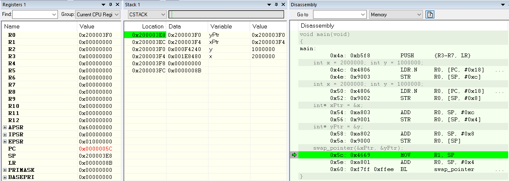
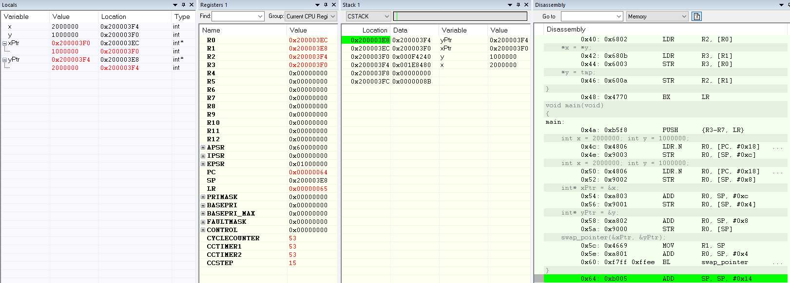
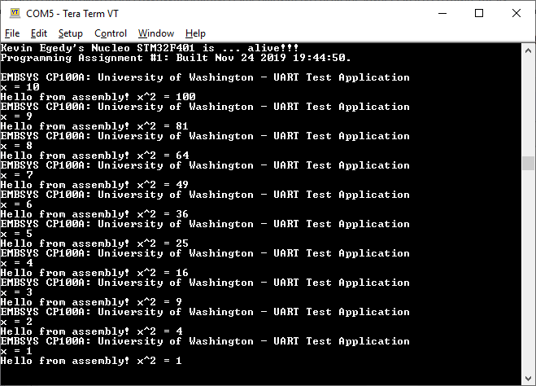

1. Create a function that allows swapping of two pointers. 

a. Explain what the “main” function does to the CSTACK in order setup the input arguments prior to calling the swap_pointer() function? 
The main function pushes registers R3-R7, LR onto the stack. It also initializes variables x, y, xPtr, yPtr in the stack. 

b. And what are the values in R0 & R1 when swap_pointer() is called? 
Register R0 is 0x200003F0 and R1 is 0x00000000 when swap_pointer is called.  
Register R0 is 0x200003EC and R1 is 0x200003E8 after swap_pointer is returned.

c. Share a screen shot of the local variables inside of “main” after the function swap_pointer() returns, showing the values of the pointers and what they are pointing to. 

2. Run sqrAsm code from the class demo.  

