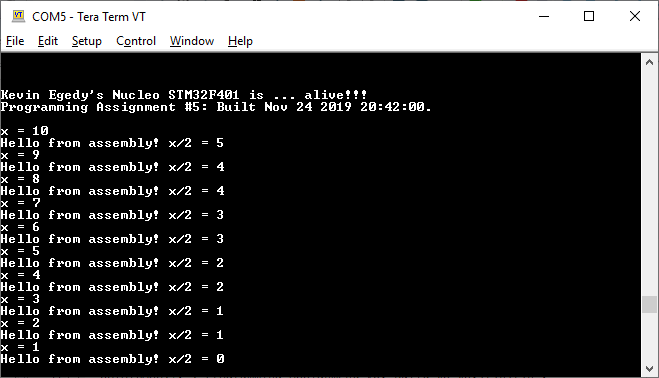

1. Create a function that allows swapping of two pointers. 

a. Explain what the “main” function does to the CSTACK in order setup the input arguments prior to calling the swap_pointer() function? 
PUSH      {R3-R7, LR}      // pushes registers in reverse order onto stack  
LDR.N     R0, [PC, #0x18]  // value at [PC + 0x18] loaded into R0; 0xf'4240  
STR       R0, [SP, #0xc]   // value at R0 stored into address at [SP + 0xC]  
LDR.N     R0, [PC, #0x18]  // value at [PC + 0x18] loaded into R0; 0x1e'8480  
STR       R0, [SP, #0x8]   // value at R0 stored into address at [SP + 0x8]  
ADD       R0, SP, #0xc     // store value at [SP + 0xC] into R0  
STR       R0, [SP, #0x4]   // value at R0 stored into address at [SP + 0x4]  
ADD       R0, SP, #0x8     // store value at [SP + 0x8] into R0  
STR       R0, [SP]         // value at R0 stored into address at [SP]  

b. And what are the values in R0 & R1 when swap_pointer() is called? 
Register R0 is 0x200003F0 and R1 is 0x00000000 when swap_pointer is called.  
Register R0 is 0x200003EC and R1 is 0x200003E8 after swap_pointer is returned.

c. Share a screen shot of the local variables inside of “main” after the function swap_pointer() returns, showing the values of the pointers and what they are pointing to. 

2. Run sqrAsm code from the class demo.  

3. Create a new file div2Asm.s and add the file to the same HelloWorld project above.   

