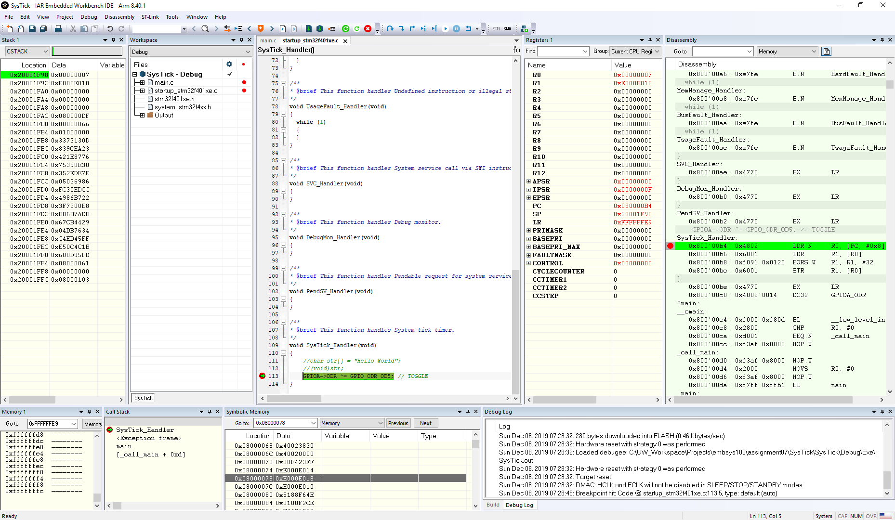
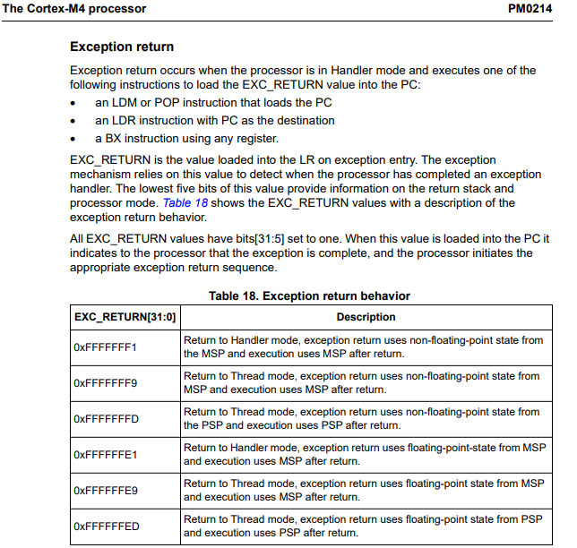

1. Starting from the blinking LED code that you created using the GPIO registers:
	- a. Define your own vector table.
	- b. Enable use of CMSIS in project options settings.
	- c. Add the files “stm32f401xe.h” & “system_stm32f4xx.h” to the folder where “main.c” is saved. You should be able to get these files thru STM32CubeMX. You could also get them by downloading the zip file “CMSIS_STM32_Device_Specific_Files.zip” from canvas site under the link Assignment\A06 folder
	- d. Enable the use of the SysTick timer and its interrupt.
	- e. Replace the delay() function with the use of the SysTick timer to blink the user LED.
	- f. Set a break point inside the SysTick_Handler interrupt and capture a snapshot of the stack once inside the interrupt and LR value. Explain what are the values stored on the stack at the moment the Handler gets invoked

2. Bonus: Improve your delay function to rely on the use of the SysTick time instead of the busy-wait loop.
![]

