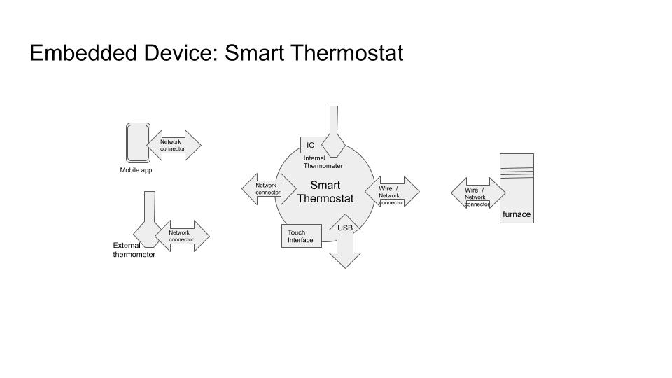

###### 1. Embedded device example Using the telegraph example, and the challenges listed in the module as reference, and describe another device that you would like to discuss. Describe how you think its embedded system works, and what design challenges it presents.

- Throughput: Reading/writing thermometers temperatures, time, custom zones features, time furnace on/off, etc.
- Response: How quickly does smart device read thermometers? How fast can it adjust the temperature of the zone?
- Testability: Equipment should be universal for any house setup.
- Debuggability: Displays error description via mobile app or digital display. For example, displays error if thermometer sensor is offline.
- Reliability: No human intervention once deployed. Only hard reset.
- Memory Space: Limited memory and is not expandable.
- Program Installation and upgrade: Device should have one-touch installation. Upgrades occur via wifi and USB.
- Power consumption: Power is consumed through house wiring or battery.
- Security: Device can be accessed manually (inside the house) or by a registered account in a mobile app. 
- Cost: Cost is driven by a premium user experience. Interface should be easy to access, understand, and use. All parts should be minimized to maximize revenue.

