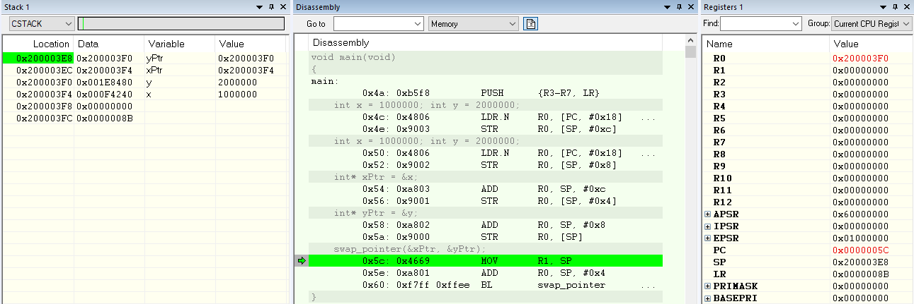
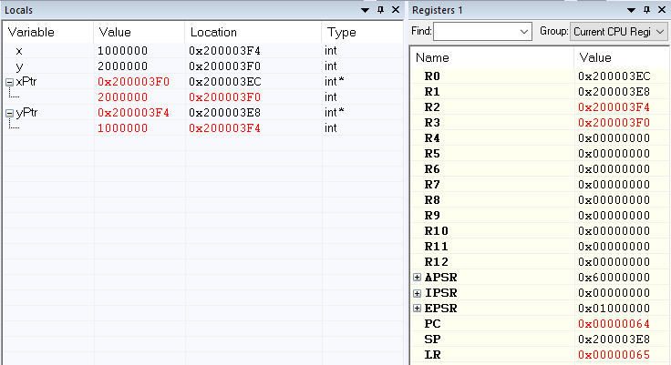
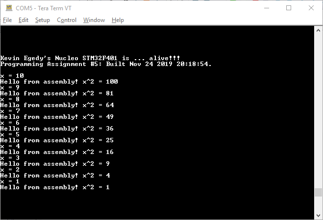

1. Create a function that allows swapping of two pointers. 

a. Explain what the “main” function does to the CSTACK in order setup the input arguments prior to calling the swap_pointer() function? 

assembly| arguments        | description                                        | alias 
------- | ---------------- | ---------------------------------------------------|-------
PUSH    |  {R3-R7, LR}     | // pushes registers in reverse order onto stack    |
LDR.N   |  R0, [PC, #0x18] | // load value at [PC + 0x18] into R0; 0xf'4240     | 
STR     |  R0, [SP, #0xc]  | // store value at R0 into address at [SP + 0xC]    | x value
LDR.N   |  R0, [PC, #0x18] | // load value at [PC + 0x18] into R0; 0x1e'8480    | 
STR     |  R0, [SP, #0x8]  | // store value at R0 into address at [SP + 0x8]    | y value
ADD     |  R0, SP, #0xc    | // sum value at [SP + 0xC] into R0                 | 
STR     |  R0, [SP, #0x4]  | // store value at R0 into address at [SP + 0x4]    | x ptr
ADD     |  R0, SP, #0x8    | // sum value at [SP + 0x8] into R0                 |
STR     |  R0, [SP]        | // store value at R0 into address at [SP]          | y ptr
MOV     |  R1, SP          | // copy SP into R1                                 | y ptr
ADD     |  R0, SP, #0x4    | // sum value at [SP + 0x4] into R0                 | x ptr
BL      |  swap_pointer    | // update PC and LR                                |

b. And what are the values in R0 & R1 when swap_pointer() is called? 
Register R0 is 0x200003EC and R1 is 0x200003E8 when swap_pointer is called.  They hold the values at locations [SP] and [SP + 0x4].

c. Share a screen shot of the local variables inside of “main” after the function swap_pointer() returns, showing the values of the pointers and what they are pointing to. 

2. Run sqrAsm code from the class demo.  

3. Create a new file div2Asm.s and add the file to the same HelloWorld project above.   

